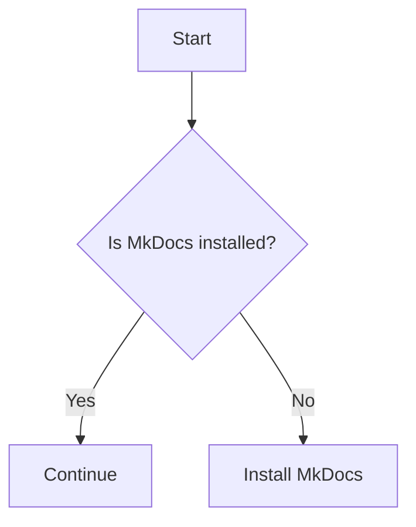

# Architecture Docs

Welcome to the Architecture Docs repository! This repo contains documentation, diagrams, and guidelines related to the architecture of our projects.

## Getting Started Locally

To work with this repository on your local machine:

1. **Clone the repository:**
    ```bash
    git clone https://github.com/your-org/architecture-docs.git
    cd architecture-docs
    ```

2. **Install MkDocs:**
    - This repository uses [MkDocs](https://www.mkdocs.org/) to build and serve documentation.
    - Install MkDocs (requires Python):
      ```bash
      pip install mkdocs
      ```

3. **Edit or add documentation:**
    - Use Markdown for all documentation.
    - Follow the existing style and structure.

4. **Preview changes locally:**
    - Start the MkDocs development server:
      ```bash
      mkdocs serve
      ```
    - Open [http://127.0.0.1:8000](http://127.0.0.1:8000) in your browser to preview.

5. **Commit and push:**
    ```bash
    git add .
    git commit -m "Describe your changes"
    git push
    ```

## Using Mermaid Diagrams

You can include diagrams using [Mermaid](https://mermaid-js.github.io/mermaid/) syntax directly in your Markdown files. MkDocs supports Mermaid via plugins (e.g., `pymdownx.superfences`).

**Example:**
<pre>

</pre>

- To enable Mermaid, ensure the MkDocs configuration includes the necessary plugin (see `mkdocs.yml`).
- Preview Mermaid diagrams locally with `mkdocs serve`.

## Adding New Projects

To add documentation for a new project:

1. **Create a new directory** under the root of the repository with the project name, for example:
    ```
    /my-new-project
    ```
2. **Add relevant documentation** (e.g., `README.md`, architecture diagrams, design decisions) inside this directory.
3. **Update `mkdocs.yml`** to include the new project in the navigation if needed.

**Example structure:**
```
/my-new-project
  ├── README.md
  ├── diagrams/
  └── design/
```

## Document Structure

- `/diagrams` — Architecture diagrams
- `/guidelines` — Best practices and standards
- `/proposals` — RFCs and architecture proposals
- `/[project-name]` — Documentation for individual projects

Organize documents by topic or project for clarity and maintainability.

## Contributing

- Please open an issue or pull request for any changes.
- Follow the code of conduct and contribution guidelines described in this README.

---

For any questions, contact the maintainers or open an issue.