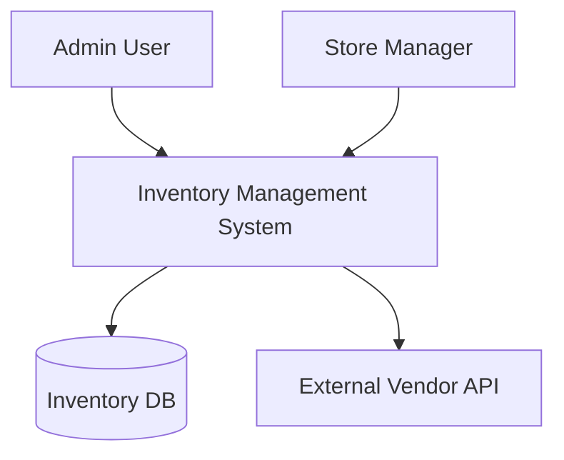

# System Context Diagram

This diagram shows how the system interacts with users and external systems.

```mermaid
%%{init: {'theme': 'default'}}%%
graph TD
    A[Admin User] --> B[Inventory Management System]
    C[Store Manager] --> B
    B --> D[(Inventory DB)]
    B --> E[External Vendor API]
```
