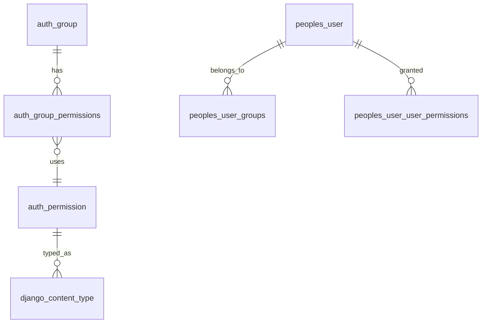
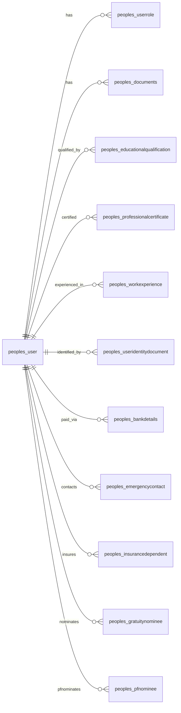
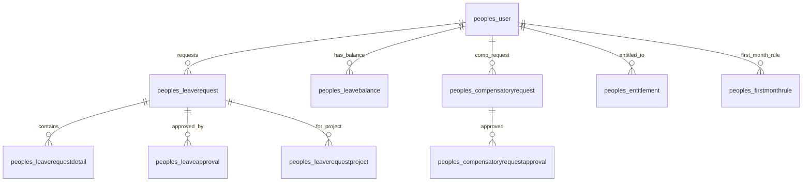
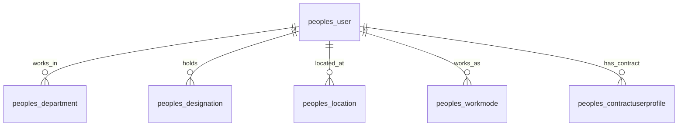
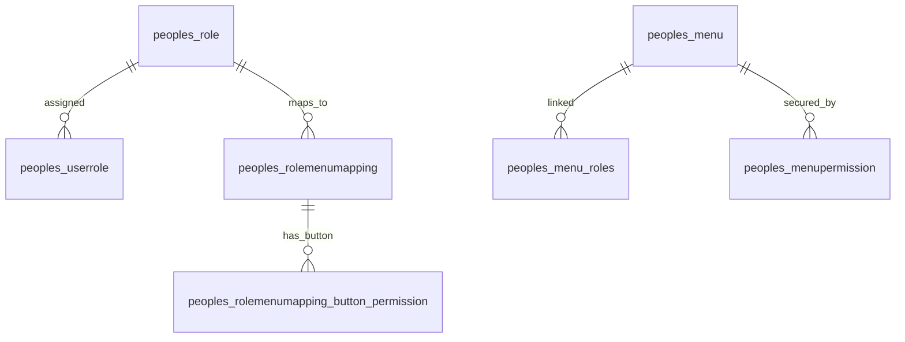
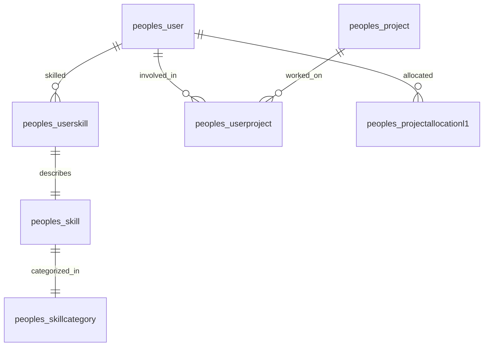
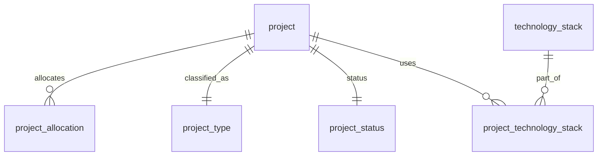
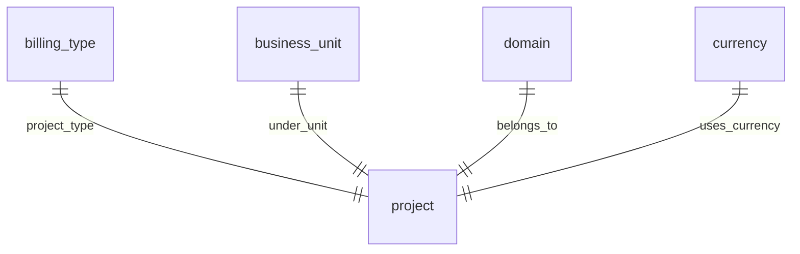

---
hide:
  - toc
---

### Auth & Permissions

### Core People Management

### Leave Management

### Organization Structure

### Roles, Menus & Permissions

### Skills & Projects

### Project Managment

### Billing, Domain, Currency

