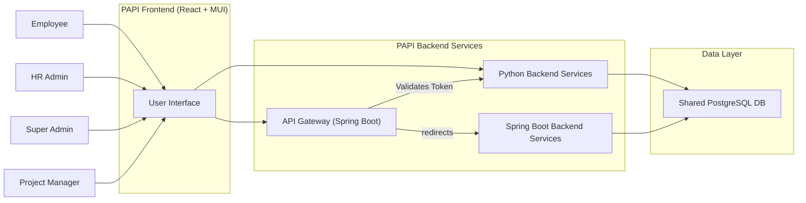

---
hide:
  - toc
---

# Container Diagram (In Progress..)

This diagram shows breakdown of internal containers, UI, services, databases, gateways etc. Also show the relation between them.

```mermaid
graph LR

    EMP[Employee]
    HRA[HR Admin]
    SA[Super Admin]
    PM[Project Manager]

    subgraph Frontend["PAPI Frontend (React + MUI)"]
        UI["User Interface"]
    end

    subgraph Backend["PAPI Backend Services"]
        Python["Python Backend Services"]
        Gateway["API Gateway (Spring Boot)"]
        Java["Spring Boot Backend Services"]
    end

    subgraph Data["Data Layer"]
        DB["Shared PostgreSQL DB"]
    end

    EMP --> UI
    HRA --> UI
    SA --> UI
    PM --> UI

    UI --> Python
    UI --> Gateway

    Gateway -- Validates Token --> Python
    Gateway -- redirects --> Java

    Python --> DB
    Java --> DB
```
